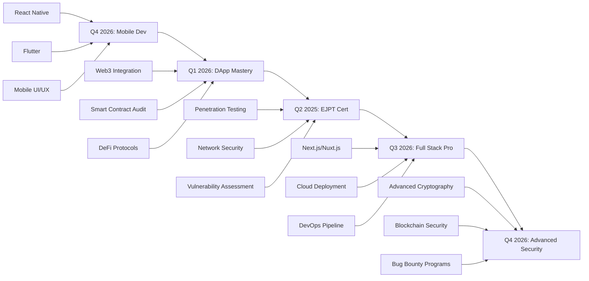

<div align="center">
  
</div>

<h3 align="center">🌟 Transforming Ideas into Secure Code | Innovating in Web3 🌟</h3>

<div align="center">
  
  
  
</div>


---


<br/>
## 🚀 **About Me**

```typescript
const Omar = {
    location: "🌍 Bolivia",
    currentFocus: ["DeFi", AI Agent, "Smart Contracts", "Cybersecurity"],
    workingOn: "Building the next generation of secure dApps",
    learning: ["Rust", "Asembler", "Advanced Cryptography"],
    askMeAbout: ["Solidity", "React", "Ethical Hacking", "Blockchain"],
    funFact: "I debug smart contracts and hunt vulnerabilities for fun! 🐛🔍",
    goals2024: "Contribute to major DeFi protocols & launch my own dApp",
    motto: "Code with purpose, secure by design 🔐"
};
```

### 🎯 **Specialties**
- 🔗 **Blockchain Development** - Smart Contracts, DeFi, Web3
- 🛡️ **Cybersecurity** - Penetration Testing, Vulnerability Assessment
- 💻 **Full Stack Development** - React, TypeScript, Node.js
- 🌐 **Network Security** - LAN/WAN Management, Security Protocols

---

## 🛠️ **Tech Arsenal**

<details open>
<summary><b>🌐 Blockchain & Web3</b></summary>
<br>


</details>

<details open>
<summary><b>💻 Languages & Frameworks</b></summary>
<br>


</details>

<details open>
<summary><b>🎨 Frontend & Design</b></summary>
<br>


</details>

<details open>
<summary><b>🗄️ Databases & Backend</b></summary>
<br>


</details>

<details open>
<summary><b>🔒 Cybersecurity & Tools 🔒</b></summary>
<br>


</details>

<details open>
<summary><b>🖥️ Systems & DevOps</b></summary>
<br>


</details>

---

## 📊 **GitHub Analytics**

<div align="center">
  
  
</div>

<div align="center">
  
</div>

<div align="center">
  
</div>

---

## 🌟 **Open Source Contributions**

```typescript
const contributionsStats = {
    totalContributions: 250,
    activeRepos: 15,
    forkedProjects: 8,
    maintainedProjects: 3,
    favoriteTechForContributing: ["React", "Solidity", "Python"],
    openSourcePhilosophy: "Code together, grow together 🚀"
};
```

<div align="center">
  
</div>

---

## 📈 **2025-2026 Development Roadmap**



---

## 🔥 **Skills in Action**

<div align="center">

### 💡 **Development Philosophy**

> *"The best code is the one you never need to write, but when you do, make it elegant, secure, and scalable"*

</div>

<details>
<summary><b>🔐 Security-First Approach</b></summary>

- **Secure by Design**: Every line of code designed with security in mind
- **Threat Modeling**: Proactive analysis of attack vectors  
- **Code Review**: Thorough reviews before deployment
- **Penetration Testing**: Regular penetration testing
- **Smart Contract Audits**: Specialized audits in Solidity

</details>

<details>
<summary><b>⚡ Agile Methodologies</b></summary>

- **Scrum Master Certified**: Agile project management
- **DevSecOps**: Security integration in CI/CD
- **Test Driven Development**: Test-oriented development
- **Continuous Integration**: Secure automated deployments
- **Code Quality**: Automated quality metrics

</details>

---

## 🌐 **Connect With Me**

<div align="center">

[](https://www.linkedin.com/in/omar-quispe-vargas-7b5601204)
[](https://x.com/OmarQV2025)
[](https://t.me/omar_q_v)
[](https://discord.com/invite/FBF8S88K)
[](mailto:quispevargasomar@gmail.com)
[](https://your-portfolio.com)

### 📧 **For Collaborations**
> **Blockchain Development** • **Security Audits** • **Technical Consulting** • **Code Reviews**

</div>

---

## 🎨 **Daily Inspirational Quote**

<div align="center">
  
</div>

---

<div align="center">

### 🚀 *"Building the future, one commit at a time"*


</div>

---
