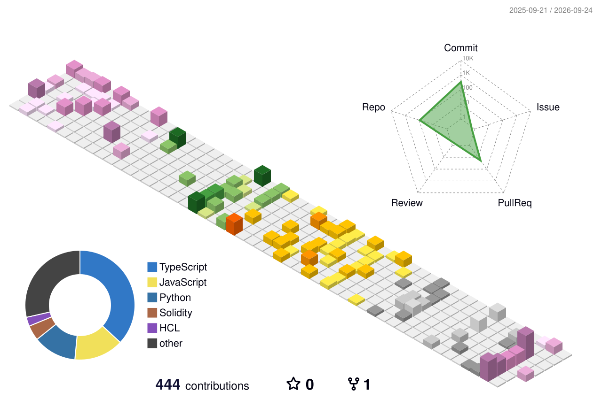

<!-- OmarQV · GitHub profile -->

<h1>Omar Quispe Vargas</h1>

<strong>Software engineering · AI agents · Web3 · security</strong> 
La Paz, Bolivia 🇧🇴

<table align="center">
<tr>
<td width="190" align="center">
   
  <strong>OMAR Q. VARGAS</strong> 
  <code>@OmarQV</code>
</td>
<td width="590" valign="top">
  <h3>OQV://IDENTITY</h3>
  <code>ROLE&nbsp;&nbsp;&nbsp;&nbsp;&nbsp; Developer · Application Development Lead</code> 
  <code>BASE&nbsp;&nbsp;&nbsp;&nbsp;&nbsp; La Paz, Bolivia</code> 
  <code>FOCUS&nbsp;&nbsp;&nbsp;&nbsp; AI Agents · Web3 · Information Security</code> 
  <code>METHOD&nbsp;&nbsp;&nbsp; Build · Trace · Verify</code>  
  
  
</td>
</tr>
</table>

> I build useful software whose decisions can be traced and whose results can be verified.

---

## ⚡ What I build

<table>
<tr>
<td width="33%" valign="top">
  <h3>🤖 Agentic systems</h3>
  AI agents, tool orchestration and payment-aware workflows with explicit limits and auditable outcomes.
</td>
<td width="33%" valign="top">
  <h3>⛓️ Web3 infrastructure</h3>
  Smart contracts, wallets and programmable payments designed for real-world use.
</td>
<td width="33%" valign="top">
  <h3>🛡️ Security &amp; forensics</h3>
  Threat-aware architecture, digital evidence and reproducible investigations.
</td>
</tr>
</table>

---

## 🏆 Milestones & recognition

| Year | Recognition |
| :--- | :--- |
| **2026** | 🥇 **1st place**, Real World Applications / HSK Chain track — Ethereum Bolivia Buildathon, Cochabamba. |
| **2026** | ✨ **Tier 2 Contributor**, Stellar Ambassador Program. |
| **2025** | 🥇 **1st place**, CochaBlock Challenge: Destino Devconnect. |

Team achievements are credited as team wins; the Stellar role is a contributor recognition, not a competition award.

---

## 🧰 Engineering stack

 

| Practice | Tools & methods |
| :--- | :--- |
| **Web & product** | TypeScript · React · Next.js · APIs · accessible interfaces |
| **AI & agents** | Python · LangGraph · MCP · tool calling · x402 |
| **Blockchain** | Solidity · EVM · Stellar/Soroban · Wagmi · Viem |
| **Security & infrastructure** | Threat modeling · digital forensics · Linux · Docker · GitHub Actions |

---

## 🧭 Current direction

- Making **autonomous-agent payments** safer through clear permissions, spending limits and verifiable receipts.
- Connecting **on-chain data and digital forensics** to evidence a third party can reproduce.
- Bringing an **information-security mindset** into product engineering from the first design decision.

---

## 📊 GitHub signal

<picture>
  <source media="(prefers-color-scheme: dark)" srcset="./profile-3d-contrib/profile-night-view.svg" />
  <source media="(prefers-color-scheme: light)" srcset="./profile-3d-contrib/profile-south-season-animate.svg" />
  
</picture>

Contribution calendar generated daily by <a href="https://github.com/yoshi389111/github-profile-3d-contrib">GitHub Profile 3D Contrib</a>. Activity is one signal, not a measure of expertise.

---

## 🌎 Beyond the code

- 🎓 Studying **Informatics, Information Security track**, at Universidad Mayor de San Andrés (UMSA).
- 📚 Also trained in **public accounting** — a useful lens for controls, traceability and auditability.
- 👨‍🏫 Former teaching assistant in **Web Programming II** at UMSA.
- 🤝 Active in Bolivia's developer and Web3 communities through workshops, hackathons and collaboration.

---

## 🤝 Let's connect

 

<strong>Open to thoughtful collaborations in AI, Web3 and security.</strong> 
OQV://BUILD · TRACE · VERIFY

