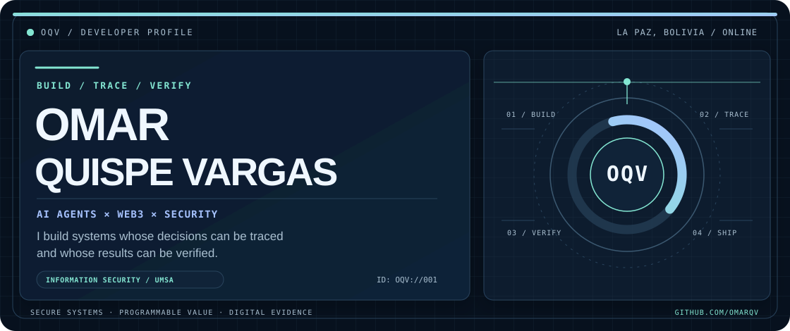
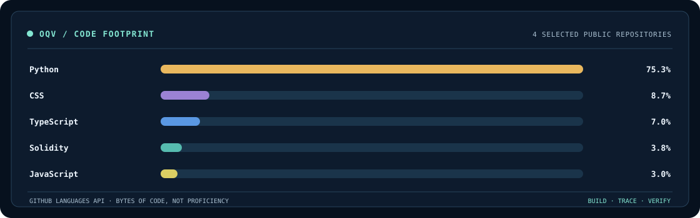

<!-- OmarQV / GitHub profile. Visual assets are maintained in this repository. -->

<picture>
  <source media="(prefers-color-scheme: dark) and (max-width: 600px)" srcset="assets/hero-mobile-dark.svg">
  <source media="(prefers-color-scheme: light) and (max-width: 600px)" srcset="assets/hero-mobile-light.svg">
  <source media="(prefers-color-scheme: dark)" srcset="assets/hero-dark.svg">
  <source media="(prefers-color-scheme: light)" srcset="assets/hero-light.svg">
  
</picture>

  <a href="https://omidev.vercel.app/">Portfolio</a> &nbsp;·&nbsp;
  <a href="https://www.linkedin.com/in/omar-quispe-vargas-7b5601204/">LinkedIn</a> &nbsp;·&nbsp;
  <a href="https://x.com/OmarQV2025">X</a> &nbsp;·&nbsp;
  <a href="mailto:quispevargasomar@gmail.com">Email</a>

## 01 / About

I'm **Omar Quispe Vargas**, a developer based in **La Paz, Bolivia**. I build at the intersection of **AI agents, programmable payments and digital evidence**.

I lead application development at Baral and study Informatics with a focus on Information Security at UMSA. My background in public accounting shapes how I approach software: make decisions traceable, controls explicit and results open to verification.

> **Build useful systems. Leave evidence. Make trust inspectable.**

## 02 / Selected work

### [Vector52](https://github.com/OmarQV/vector52) · Onchain forensics

A team project for investigating onchain claims with preserved evidence, attributable flows, counterevidence and explicit limits. I led the frontend and integration work for the ETHOnline iteration; the project later won the **Real World Applications / HSK Chain** track at Buildathon Cochabamba 2026.

`React` `TypeScript` `FastAPI` `Python` `Ethereum RPC` `The Graph`

[Explore the repository →](https://github.com/OmarQV/vector52)

### [Pay-per-Thought](https://lablab.ai/ai-hackathons/nano-payments-arc/pay-per-thought/pay-per-thought-verifiable-ai-payments-on-arc) · Agent payments

An agent workflow that plans tasks, authorizes spend and pays for API calls with USDC on Arc Testnet. The hackathon submission documents **111 onchain transactions** and a verifiable receipt for each answer.

`Python` `LangGraph` `x402` `Vyper` `Arc` `Circle`

[Project and evidence →](https://lablab.ai/ai-hackathons/nano-payments-arc/pay-per-thought/pay-per-thought-verifiable-ai-payments-on-arc) · [Live demo →](https://pay-per-thought.vercel.app/)

### [AIni Pay](https://aini-pay.vercel.app/) · Multichain payments

An AI-assisted Web3 payment experience built with a team across EVM and Celestia. The project earned **1st place at CochaBlock: Destino Devconnect 2025**.

`React` `Vite` `Wagmi` `Viem` `Celestia`

[Open the demo →](https://aini-pay.vercel.app/)

### [AndesMaaS 3.0](https://andesmaas-3-0.vercel.app/app) · Mobility / DePIN

An exploration of mobility infrastructure and gamified participation for La Paz, built around the Stellar ecosystem.

`Stellar` `Soroban` `Web3`

[Try the demo →](https://andesmaas-3-0.vercel.app/app) · [Watch the walkthrough →](https://youtu.be/8ZjMN5mYSgs)

## 03 / How I build

| Layer | Tools and interests |
| :--- | :--- |
| **Product** | TypeScript · React · Next.js · Tailwind CSS |
| **Agents and APIs** | Python · FastAPI · LangGraph · MCP · x402 |
| **Onchain** | Solidity · Vyper · EVM · Stellar · Wagmi · Viem |
| **Security** | Threat modeling · digital forensics · reproducible evidence · Linux |

My current questions: **How can agents transact with clear limits? How can a blockchain investigation be reproduced by someone who wasn't in the room?**

## 04 / Community and milestones

- **2026** · Stellar Ambassador Program, Tier 2 Contributor.
- **2025** · CochaBlock winner with AIni Pay; later participated in Devconnect Argentina.
- **2024** · Teaching assistant for Web Programming II at UMSA.
- **2026** · Co-organizer of developer events and workshops in La Paz.

## 05 / Code footprint

<picture>
  <source media="(prefers-color-scheme: dark) and (max-width: 600px)" srcset="assets/footprint-mobile-dark.svg">
  <source media="(prefers-color-scheme: light) and (max-width: 600px)" srcset="assets/footprint-mobile-light.svg">
  <source media="(prefers-color-scheme: dark)" srcset="assets/footprint-dark.svg">
  <source media="(prefers-color-scheme: light)" srcset="assets/footprint-light.svg">
  
</picture>

Generated from code bytes in four selected public repositories. This shows repository composition, not proficiency. <a href="scripts/render_profile.py">See the source</a>.

---

  <strong>OQV://BUILD · TRACE · VERIFY</strong> 
  Open to thoughtful collaborations in AI, Web3 and security · <a href="mailto:quispevargasomar@gmail.com">Let's talk</a>

