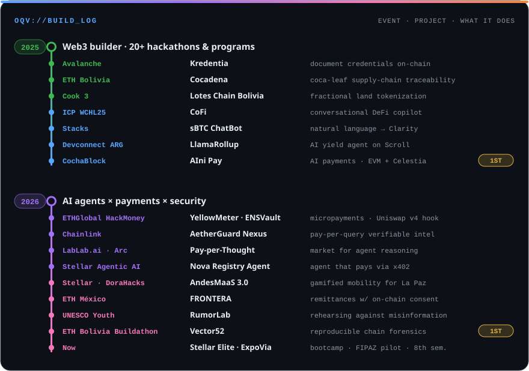

<!-- OmarQV · GitHub profile · OQV 2.0 (Sept 2026)
     assets/*.svg are regenerated daily by .github/workflows/update-profile.yml
     → scripts/render_profile.py. Edit card fields and the build log in
     profile.json, not in the SVGs. -->

<div align="center">

<picture>
  <source media="(prefers-color-scheme: dark)" srcset="./assets/credential-dark.svg" />
  <source media="(prefers-color-scheme: light)" srcset="./assets/credential-light.svg" />
  
</picture>


</div>

```console
$ whoami
> Omar Quispe Vargas — software engineer from La Paz, Bolivia
> I build at the intersection of AI agents, Web3 and information security.

$ cat principles.txt
> The core computes. The evidence proves. The agent explains. The person decides.

$ ls ./current_focus
agent-payments/   blockchain-forensics/   x402/   secure-by-design/   dev-communities/
```

<p align="center"></p>

## 🏆 Milestones & recognition

| Year | Recognition |
| :--- | :--- |
| **2026** | 🥇 **1st place**, Real World Applications / HSK Chain track: Ethereum Bolivia Buildathon, Cochabamba (Vector52). |
| **2026** | ✨ **Tier 2 Contributor**, Stellar Ambassador Program. Selected for **Stellar Elite**. |
| **2026** | 🎓 **Aspire Institute** program completed with certificate. |
| **2025** | 🥇 **1st place**, CochaBlock Challenge: Destino Devconnect (AIni Pay). |
| **2025–26** | 🧑‍🤝‍🧑 Co-organizer of **Aleph Hackathon: La Paz chapter** and the **Vercel hackathon at UMSA**. |

<sub>Team achievements are credited as team wins. The Stellar role is contributor recognition, not a competition award.</sub>

<p align="center"></p>

## 🗺️ Build log

<picture>
  <source media="(prefers-color-scheme: dark)" srcset="./assets/buildlog-dark.svg" />
  <source media="(prefers-color-scheme: light)" srcset="./assets/buildlog-light.svg" />
  
</picture>

<p align="center"></p>

## 🧰 Engineering stack

<div align="center">


</div>

<br />

| Practice | Tools & methods |
| :--- | :--- |
|  | Python · LangGraph · MCP · tool calling · x402 agent payments · Claude / Gemini |
|  | Solidity · Vyper · Foundry · Hardhat · EVM · Stellar/Soroban · Avalanche · Wagmi · Viem |
|  | TypeScript · React · Next.js · Expo / React Native · Flutter · FastAPI · Supabase |
|  | Threat modeling · digital & on-chain forensics · smart-contract review · CTF practice (eJPT track) |

<p align="center"></p>

## 📊 GitHub signal

<div align="center">

<picture>
  <source media="(prefers-color-scheme: dark)" srcset="./profile-3d-contrib/profile-night-view.svg" />
  <source media="(prefers-color-scheme: light)" srcset="./profile-3d-contrib/profile-south-season-animate.svg" />
  
</picture>

<sub>Generated daily by <a href="https://github.com/yoshi389111/github-profile-3d-contrib">GitHub Profile 3D Contrib</a>. Activity is one signal, not a measure of expertise.</sub>

</div>

<p align="center"></p>

## 🌎 Beyond the code

- 🎓 **Informatics, Information Security track** at Universidad Mayor de San Andrés (UMSA). Now in 8th semester: risk management, information-asset management and systems auditing.
- 📚 Also trained in **public accounting**, which gives me a useful lens for controls, traceability and auditability.
- 👨‍🏫 Former teaching assistant in **Web Programming II** at UMSA.
- 🤝 Active in Bolivia’s developer and Web3 communities through workshops, hackathons and event organizing.

<p align="center"></p>

## 🤝 Let's connect

<div align="center">

[](https://omidev.vercel.app/)
[](https://www.linkedin.com/in/omar-quispe-vargas-7b5601204/)
[](https://x.com/OmarQV2025)
[](mailto:quispevargasomar@gmail.com)

<br />

<strong>Open to collaborations, hackathon teams and roles in AI agents, Web3 and security.</strong><br />
<sub>OQV://BUILD · TRACE · VERIFY</sub>

</div>
